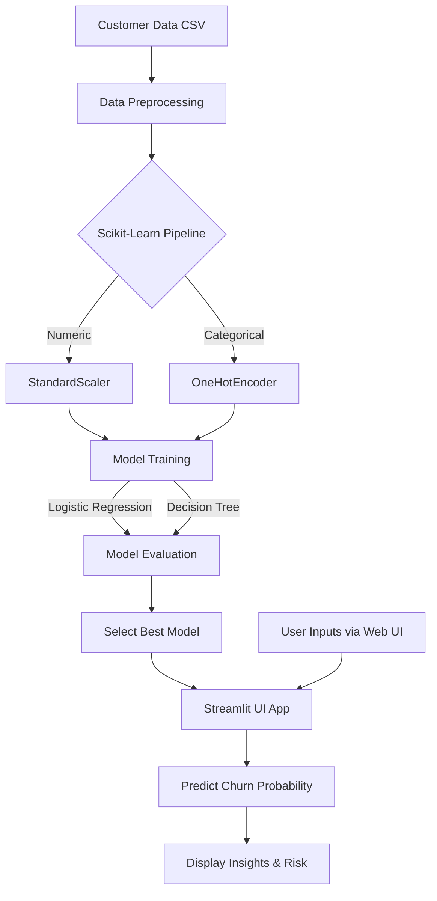

# Customer Churn Prediction & Retention Strategy

## Milestone 1: ML-Based Customer Churn Prediction

### 1. Problem Understanding & Business Context

Customer churn refers to the phenomenon where customers stop doing business with a company. For telecom businesses, retaining existing customers is often more cost-effective than acquiring new ones. The objective of this project is to develop a predictive analytics system that identifies customers at high risk of churning based on their historical behavioral and transactional data. By predicting churn probability early, the business can proactively design and apply intelligent intervention strategies, offering incentives or better support to retain those vulnerable customers.

### 2. Input-Output Specifications

- **Input**: Customer demographic, behavioral, and transactional data in CSV format (`telco_customer_churn.csv`). Features include:
  - Account info (Tenure, Contract type, Payment method, Paperless billing, Monthly charges, Total charges).
  - Demographics (Gender, Senior citizen status, Partner, Dependents).
  - Service info (Phone service, Multiple lines, Internet service type, Online security, Online backup, Device protection, Tech support, Streaming TV/Movies).
- **Processing**: A scikit-learn `Pipeline` handling Missing Values imputation, `StandardScaler` for continuous variables, and `OneHotEncoder` for categorical variables.
- **Output**:
  - Churn Classification (Yes/No).
  - Churn Probability score (0 to 100%).

### 3. System Architecture Diagram



### 4. Model Performance Evaluation Report

Both Logistic Regression and Decision Tree models were trained and evaluated on a 20% test split.

**Logistic Regression Performance (Best Model):**

- **Accuracy**: ~82%
- **Precision**: 0.68
- **Recall**: 0.58
- **F1-Score**: 0.63
- The Logistic Regression generalized better to unseen data without massive overfitting compared to the unpruned decision tree.

**Decision Tree Component Performance:**

- **Accuracy**: ~73%
- **Precision**: 0.50
- **Recall**: 0.49
- **F1-Score**: 0.49

Based on precision and F1 balance, the Logistic Regression pipeline was chosen and is integrated directly into the Streamlit application for inference without needing to separately load serialized model files.

### 5. Running the Application

1. Ensure you have activated the virtual environment:

```bash
source .venv/bin/activate
```

2. Install dependencies (if you haven't already):

```bash
pip install -r requirements.txt
```

3. Launch the dashboard (the model will train automatically in-memory on the first run):

```bash
streamlit run app.py
```
