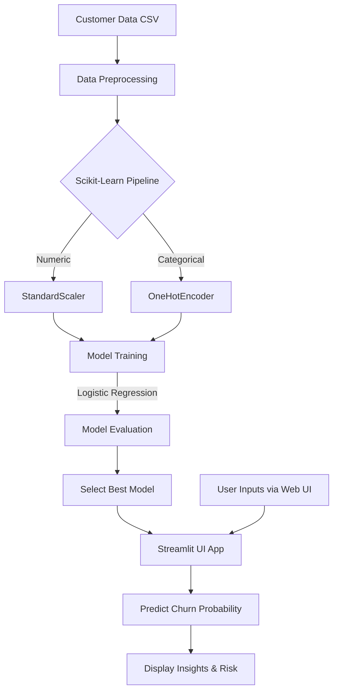

# Customer Churn Prediction & Agentic Retention Strategy

*From Predictive Analytics to Intelligent Intervention*

## Project Overview

Customer churn is one of the biggest challenges telecom companies face today. Losing a customer isn't just about one cancelled subscription; it snowballs into lost revenue, higher acquisition costs, and a weakened brand. This project tackles that problem head on by building an AI powered system that not only predicts which customers are likely to leave, but eventually evolves into an intelligent agent that can suggest personalized retention strategies.

We worked with the Telco Customer Churn dataset, which captures real world customer behavior like how long they've been with the company, what services they use, how much they pay, and whether or not they ended up churning. The goal was to dig into this data, find meaningful patterns, and train a model that can flag at risk customers before it's too late.

Milestone 1 focuses on classical machine learning. We used techniques like Logistic Regression along with thoughtful feature engineering to build a churn prediction pipeline. The results are served through a clean, interactive Streamlit dashboard where users can explore the data visually and even test predictions for individual customers.

Milestone 2 takes things further by introducing an agent based AI layer. The idea here is to move beyond just predicting churn and actually reason about it. Using frameworks like LangGraph and retrieval augmented generation (RAG), the system will pull in retention best practices and generate structured intervention plans tailored to each customer's situation.

## Milestone 1: ML-Based Customer Churn Prediction

### 2. Input-Output Specifications

- **Input**: Customer demographic, behavioral, and transactional data in CSV format (`telco_customer_churn.csv`). Features include:
  - Account info (Tenure, Contract type, Payment method, Paperless billing, Monthly charges, Total charges).
  - Demographics (Gender, Senior citizen status, Partner, Dependents).
  - Service info (Phone service, Multiple lines, Internet service type, Online security, Online backup, Device protection, Tech support, Streaming TV/Movies).
- **Processing**: A scikit-learn `Pipeline` handling Missing Values imputation, `StandardScaler` for continuous variables, and `OneHotEncoder` for categorical variables.
- **Output**:
  - Churn Classification (Yes/No).
  - Churn Probability score (0 to 100%).

### 3. System Architecture Diagram



### 4. Model Performance Evaluation Report

The Logistic Regression and XGBoost models were trained and evaluated on a 20% test split.

**Logistic Regression Performance (Best Model):**

- **Accuracy**: ~82%
- **Precision**: 0.68
- **Recall**: 0.58
- **F1-Score**: 0.63
- **Accuracy**: ~73%
- **Precision**: 0.50
- **Recall**: 0.49
- **F1-Score**: 0.49

Based on precision and F1 balance, the Logistic Regression pipeline was chosen and is integrated directly into the Streamlit application for inference without needing to separately load serialized model files.

### 5. Running the Application

1. Ensure you have activated the virtual environment:

```bash
source .venv/bin/activate
```

2. Install dependencies (if you haven't already):

```bash
pip install -r requirements.txt
```

3. Launch the dashboard (the model will train automatically in-memory on the first run):

```bash
streamlit run app.py
```
